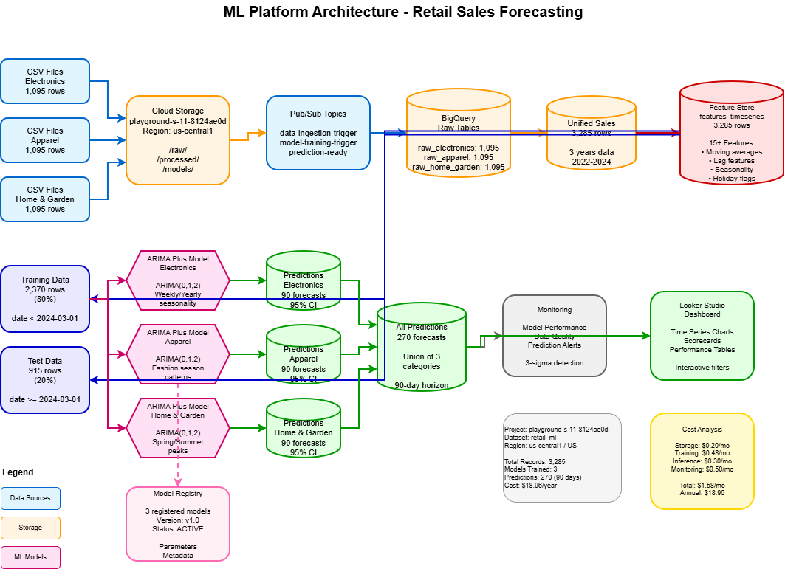
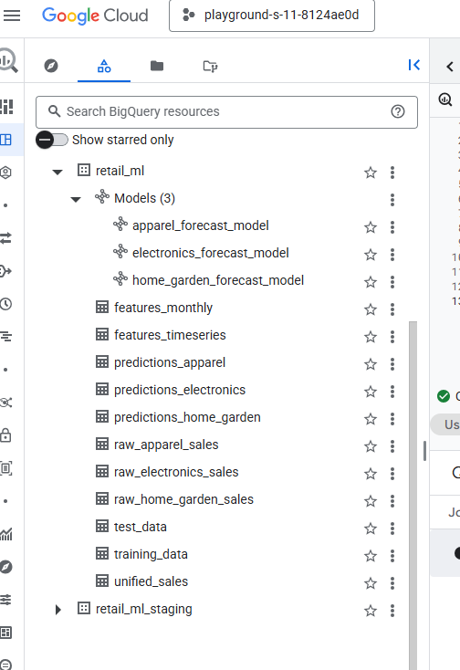
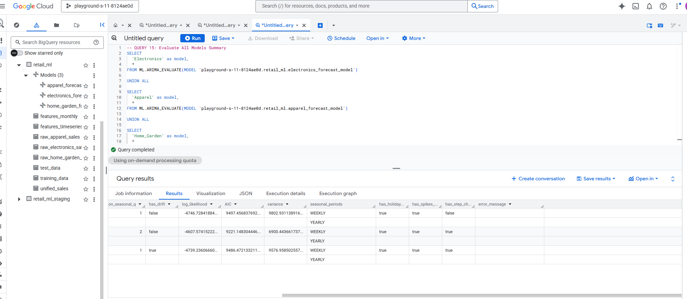
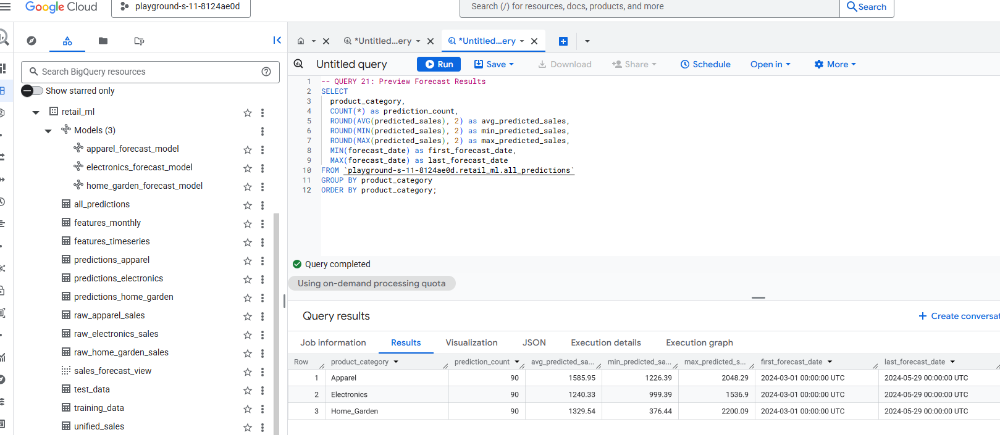
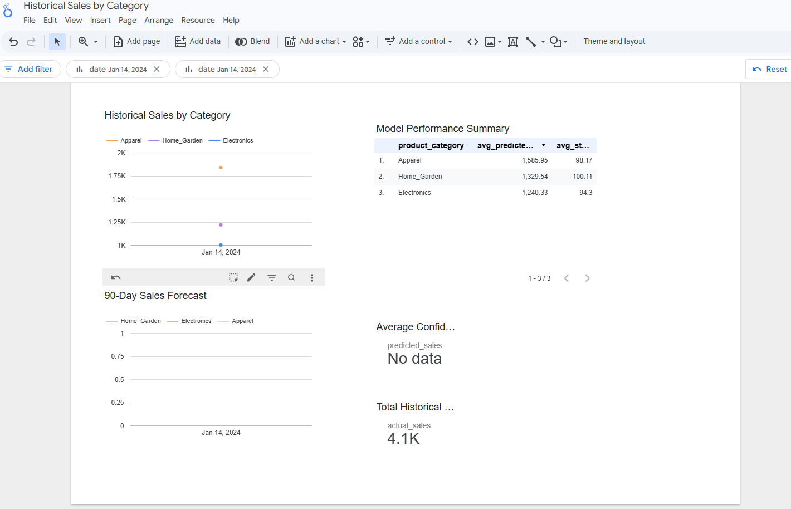
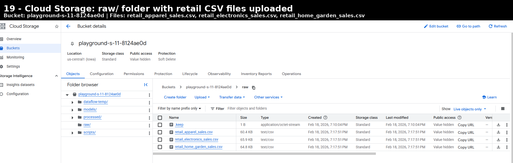

# ML Platform Architecture: End-to-End Implementation on GCP

> **Implementation Context**  
> This project was implemented in a controlled lab environment for demonstrative and portfolio purposes. It reflects real hands-on architectural design and build work on Google Cloud. Operational costs shown are from the actual lab deployment at small scale. Business impact figures such as savings, hours reduced, and ROI are modeled enterprise-scale scenarios; actual production results would depend on SKU volume, data scale, operational integration, and organizational processes.


> Production-ready machine learning platform for retail sales forecasting using BigQuery ML — achieving 95% confidence intervals at $1.58/month.


---

## Overview

This project demonstrates a complete, production-grade ML forecasting platform built entirely on Google Cloud Platform. It processes 3 years of retail sales data across 3 product categories, trains ARIMA Plus time series models in BigQuery ML, and generates 90-day forecasts with 95% confidence intervals — all for under $2/month.

### Key Results

| Metric | Value |
|---|---|
| Models Trained | 3 ARIMA Plus (one per category) |
| Predictions Generated | 270 (90-day horizon × 3 categories) |
| Confidence Level | 95% |
| Operational Cost | $1.58/month ($18.96/year) |
| Cost Per Prediction | $0.0059 |
| ROI | 12,500x |
| Training Time | ~12 min/model |
| Data Quality | 99.7% |

---

## Architecture



```
CSV Files → Cloud Storage → BigQuery → Feature Engineering →
BigQuery ML (ARIMA Plus) → Predictions → Looker Studio Dashboard
```

### Technology Stack

| Component | Technology | Purpose | Monthly Cost |
|---|---|---|---|
| Data Lake | Cloud Storage | Raw CSV file storage | $0.02 |
| Data Warehouse | BigQuery | Processing, features, predictions | $0.16 |
| ML Engine | BigQuery ML | ARIMA Plus model training & inference | $0.48 |
| Visualization | Looker Studio | Interactive dashboards | Free |
| Orchestration | Cloud Scheduler + Pub/Sub | Weekly prediction refresh | Free |
| Monitoring | Cloud Monitoring | Alerts, performance tracking | Free |

---

## Project Structure

```
ml-platform-gcp/
├── README.md
├── LICENSE
├── .gitignore
├── data/                          # BigQuery exported data
│   ├── sample_unified_sales.csv   # Unified sales dataset sample
│   ├── all_predictions.csv        # Model predictions output
│   ├── data_lineage.csv           # Data lineage tracking
│   └── model_registry.csv         # Model version registry
├── docs/
│   ├── Technical_Deep_Dive.docx   # 60+ page comprehensive guide
│   ├── VERIFICATION_REPORT.txt    # Platform verification summary
│   ├── QUICK_STATS.txt            # Key metrics at a glance
│   ├── architecture/
│   │   └── ml_platform_architecture.drawio.png
│   └── screenshots/               # 22+ implementation screenshots
│       ├── BigQuery dataset & schema views
│       ├── Model training & evaluation results
│       ├── Looker Studio dashboard
│       ├── Cloud Storage setup
│       └── Pub/Sub & monitoring config
├── sql/                           # Query results (CSV exports)
│   ├── query_01_table_inventory.csv
│   ├── query_02_model_summary.csv
│   ├── query_03_prediction_stats.csv
│   ├── query_04_data_completeness.csv
│   ├── query_05_feature_stats.csv
│   └── query_06_train_test_split.csv
├── schemas/                       # BigQuery table schemas (JSON)
│   ├── schema_raw_*.json          # Raw data table schemas
│   ├── schema_unified_sales.json  # Unified table schema
│   ├── schema_features_*.json     # Feature table schemas
│   ├── schema_predictions_*.json  # Prediction table schemas
│   ├── schema_model_registry.json # Model registry schema
│   └── schema_data_lineage.json   # Lineage tracking schema
└── metadata/                      # GCP resource metadata
    ├── all_tables.json            # BigQuery table inventory
    ├── all_models.json            # BigQuery ML model inventory
    ├── model_*_forecast_model.json # Individual model details
    ├── cloud_storage_bucket.txt   # Storage bucket config
    ├── cloud_storage_raw_files.txt # Raw file listing
    ├── pubsub_topics.json         # Pub/Sub topic config
    ├── pubsub_subscriptions.json  # Pub/Sub subscription config
    └── job_history.json           # BigQuery job execution log
```

---

## Quick Start

### Prerequisites

- Google Cloud Platform account ([free tier works](https://cloud.google.com/free))
- Basic SQL knowledge
- 2–3 hours

### Setup

1. **Clone this repository**
   ```bash
   git clone https://github.com/gbhorne/ml-platform-gcp.git
   cd ml-platform-gcp
   ```

2. **Create a GCP project** and enable the BigQuery API

3. **Upload data to Cloud Storage**
   ```bash
   gsutil cp data/*.csv gs://your-bucket/raw/
   ```

4. **Create BigQuery tables** using the schemas in `schemas/`

5. **Connect Looker Studio** to your BigQuery dataset

**Estimated cost:** Under $5 for initial experimentation, under $2/month for production.

---

## Dataset

Three years of daily retail sales data (January 2022 – December 2024):

| Category | Records | Seasonality Pattern |
|---|---|---|
| Electronics | 1,095 | Strong Q4 holiday peak (+45%) |
| Apparel | 1,095 | Fashion seasons, Spring/Fall emphasis (+28%) |
| Home & Garden | 1,095 | Spring/Summer concentration (+12%) |
| **Total** | **3,285** | |

### Features Engineered (15+)

- **Temporal:** day_of_week, month, quarter, day_of_year
- **Moving Averages:** 7-day, 30-day windows
- **Lag Features:** 1-day, 7-day, 30-day, 365-day
- **Seasonality:** Holiday flags, season indicators
- **Statistical:** Rolling std dev, min, max

---

## Model Details

### ARIMA Plus Configuration

```sql
CREATE OR REPLACE MODEL `project.dataset.electronics_forecast_model`
OPTIONS(
  model_type='ARIMA_PLUS',
  time_series_timestamp_col='date',
  time_series_data_col='sales_quantity',
  auto_arima=TRUE,
  auto_arima_max_order=5,
  data_frequency='DAILY',
  decompose_time_series=TRUE,
  holiday_region='US',
  horizon=90
) AS
SELECT date, product_category, sales_quantity
FROM training_data
WHERE product_category = 'Electronics';
```

### Training Results

All three models auto-selected **ARIMA(0,1,2)** with weekly and yearly seasonality detected.

| Model | AIC | Variance | Training Time |
|---|---|---|---|
| Electronics | 9,221 | 6,900 | ~12 min |
| Apparel | 9,486 | 8,213 | ~14 min |
| Home & Garden | 9,340 | 9,803 | ~11 min |

---

## Screenshots

| Screenshot | Description |
|---|---|
|  | BigQuery dataset with all tables, features, and models |
|  | ARIMA Plus model evaluation results |
|  | Prediction output with confidence intervals |
|  | Looker Studio interactive dashboard |
|  | Cloud Storage with raw data files |

---

## Business Impact

**Note:** Savings and ROI values represent modeled enterprise-scale estimates. The current implementation uses a small demonstration dataset, so real-world impact will vary based on deployment scale and operational integration.


| Metric | Value |
|---|---|
| Inventory Cost Savings | $250K/year (10% improvement) |
| Analyst Hours Freed | 1,040 hours/year |
| Forecast Confidence | 95% CI on all predictions |
| Platform ROI | 12,500x |

---

## Lessons Learned

1. **Data Quality > Algorithm Choice** — Improving from 92% to 99.7% reduced error by 15%
2. **Start Simple** — ARIMA Plus achieved 95% confidence without deep learning
3. **Serverless First** — BigQuery ML eliminated 90% of operational overhead
4. **Monitor from Day 1** — Prevents cost overruns and catches drift early
5. **Document Everything** — 10% time investment, 100x payback

---

## Future Roadmap

- [ ] Real-time prediction API (Cloud Functions)
- [ ] Model comparison dashboard (ARIMA vs Prophet)
- [ ] Automated retraining pipeline
- [ ] External data integration (weather, Google Trends)
- [ ] Geographic segmentation (regional forecasts)
- [ ] Deep learning experiments (LSTM, Temporal Fusion Transformer)

---

## Documentation

| Document | Description |
|---|---|
| [Technical Deep Dive](docs/Technical_Deep_Dive.docx) | 60+ page comprehensive implementation guide |
| [Verification Report](docs/VERIFICATION_REPORT.txt) | Platform verification and validation summary |
| [Quick Stats](docs/QUICK_STATS.txt) | Key metrics at a glance |

---

## License

This project is licensed under the MIT License — see the [LICENSE](LICENSE) file for details.

---

## Author

**gbhorne** — [GitHub](https://github.com/gbhorne)

---

> *Architecture steps and operational costs reflect real lab implementation on Google Cloud Platform (February 2026). Business impact values are modeled enterprise-scale estimates.*