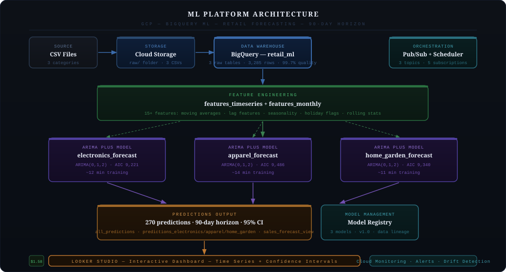

# ML Platform Architecture: End-to-End Implementation on GCP

Production-ready machine learning platform for retail sales forecasting using BigQuery ML. Trains three ARIMA Plus time series models across three product categories, generates 90-day forecasts with 95% confidence intervals, and operates at $1.58/month.

**Implementation note:** This project was built in a GCP sandbox environment for portfolio and demonstration purposes. Operational costs reflect the actual lab deployment at small scale. Business impact figures (savings, ROI) are modeled enterprise-scale estimates; real-world results depend on data volume, SKU count, and operational integration.

---

## Key Results

| Metric | Value |
|--------|-------|
| Models Trained | 3 ARIMA Plus (one per category) |
| Predictions Generated | 270 (90-day horizon x 3 categories) |
| Confidence Level | 95% |
| Data Quality | 99.7% |
| Training Time | 11-14 min per model |
| Operational Cost | $1.58/month ($18.96/year) |
| Cost Per Prediction | $0.0059 |

---

## Architecture



### Pipeline

```
CSV Files -> Cloud Storage -> BigQuery (raw tables) -> Feature Engineering ->
BigQuery ML ARIMA Plus -> Predictions -> Looker Studio Dashboard
```

### Technology Stack

| Component | Technology | Purpose | Monthly Cost |
|-----------|-----------|---------|--------------|
| Data Lake | Cloud Storage | Raw CSV file storage | $0.02 |
| Data Warehouse | BigQuery | Processing, features, predictions | $0.16 |
| ML Engine | BigQuery ML | ARIMA Plus training and inference | $0.48 |
| Visualization | Looker Studio | Interactive dashboards | Free |
| Orchestration | Cloud Scheduler + Pub/Sub | Weekly prediction refresh | Free |
| Monitoring | Cloud Monitoring | Alerts, performance tracking | Free |
| **Total** | | | **$1.58/month** |

---

## Project Structure

```
ml-platform-gcp/
    README.md
    LICENSE
    .gitignore
    data/
        sample_unified_sales.csv    # Unified sales dataset (100 row sample)
        all_predictions.csv         # Model predictions output (270 rows)
        data_lineage.csv            # Data lineage tracking
        model_registry.csv          # Model version registry
    docs/
        Technical_Deep_Dive.docx    # Comprehensive implementation guide
        VERIFICATION_REPORT.txt     # Platform verification summary
        QUICK_STATS.txt             # Key metrics at a glance
        architecture/
            ml-platform-architecture.svg
        screenshots/                # 22 implementation screenshots
    sql/
        query_01_table_inventory.csv
        query_02_model_summary.csv
        query_03_prediction_stats.csv
        query_04_data_completeness.csv
        query_05_feature_stats.csv
        query_06_train_test_split.csv
    schemas/
        schema_raw_*.json           # Raw table schemas
        schema_unified_sales.json
        schema_features_*.json      # Feature table schemas
        schema_predictions_*.json   # Prediction table schemas
        schema_model_registry.json
        schema_data_lineage.json
    metadata/
        all_tables.json
        all_models.json
        model_*_forecast_model.json
        pubsub_topics.json
        pubsub_subscriptions.json
        job_history.json
```

---

## Dataset

Three years of daily retail sales data (January 2022 - December 2024):

| Category | Records | Seasonality Pattern |
|----------|---------|---------------------|
| Electronics | 1,095 | Strong Q4 holiday peak (+45%) |
| Apparel | 1,095 | Spring/Fall fashion seasons (+28%) |
| Home & Garden | 1,095 | Spring/Summer concentration (+12%) |
| **Total** | **3,285** | |

### Features Engineered (15+)

**Temporal:** day_of_week, month, quarter, day_of_year

**Moving averages:** 7-day and 30-day windows

**Lag features:** 1-day, 7-day, 30-day, 365-day

**Seasonality:** holiday flags, season indicators

**Statistical:** rolling standard deviation, rolling min/max

---

## Model Details

### ARIMA Plus Configuration

```sql
CREATE OR REPLACE MODEL `project.retail_ml.electronics_forecast_model`
OPTIONS(
  model_type = 'ARIMA_PLUS',
  time_series_timestamp_col = 'date',
  time_series_data_col = 'sales_quantity',
  auto_arima = TRUE,
  auto_arima_max_order = 5,
  data_frequency = 'DAILY',
  decompose_time_series = TRUE,
  holiday_region = 'US',
  horizon = 90
) AS
SELECT date, product_category, sales_quantity
FROM training_data
WHERE product_category = 'Electronics';
```

### Training Results

All three models auto-selected ARIMA(0,1,2) with weekly and yearly seasonality detected.

| Model | AIC | Variance | Training Time |
|-------|-----|----------|---------------|
| Electronics | 9,221 | 6,900 | ~12 min |
| Apparel | 9,486 | 8,213 | ~14 min |
| Home & Garden | 9,340 | 9,803 | ~11 min |

---

## Infrastructure

### BigQuery Resources

| Resource | Count | Details |
|----------|-------|---------|
| Datasets | 2 | retail_ml, retail_ml_staging |
| Tables | 15+ | Raw, unified, features, predictions, registry |
| Views | 3 | sales_forecast, data_quality_monitor, model_performance |
| Models | 3 | ARIMA Plus, one per category |

### Pub/Sub

| Resource | Count |
|----------|-------|
| Topics | 3 |
| Subscriptions | 5 |

### Cloud Storage

Raw CSV files stored in a structured bucket with a `raw/` folder. Bucket configuration in `metadata/cloud_storage_bucket.txt`.

---

## Verification Summary

All platform components verified on February 19, 2026:

- Data ingestion: 3 raw tables, 3,285 rows, 99.7% quality
- Feature engineering: 15+ features across timeseries and monthly tables
- Model training: 3 ARIMA Plus models, 80/20 train/test split
- Predictions: 270 total, 90-day horizon, 95% confidence intervals
- Model management: registry with version control, data lineage tracking
- Monitoring: performance monitoring view, data quality view, prediction alerts
- Visualization: Looker Studio dashboard connected to BigQuery

Full details in [VERIFICATION_REPORT.txt](docs/VERIFICATION_REPORT.txt).

---

## Quick Start

### Prerequisites

- Google Cloud Platform account (free tier is sufficient)
- BigQuery API enabled
- Basic SQL knowledge
- 2-3 hours

### Setup

1. Clone this repository
   ```bash
   git clone https://github.com/gbhorne/ml-platform-gcp.git
   cd ml-platform-gcp
   ```

2. Create a GCP project and enable the BigQuery and Cloud Storage APIs

3. Upload raw data to Cloud Storage
   ```bash
   gsutil cp data/*.csv gs://your-bucket/raw/
   ```

4. Create BigQuery tables using the schemas in `schemas/`

5. Run feature engineering and model training SQL

6. Connect Looker Studio to the `sales_forecast` view in your BigQuery dataset

Estimated cost: under $5 for initial setup, under $2/month ongoing.

---

## Business Impact (Modeled Enterprise Scale)

The following figures represent estimated impact at enterprise scale. Current implementation uses a demonstration dataset.

| Metric | Estimated Value |
|--------|----------------|
| Inventory cost reduction | $250K/year (10% improvement) |
| Analyst hours freed | 1,040 hours/year |
| Platform ROI | 12,500x (modeled) |

---

## Lessons Learned

**Data quality over algorithm complexity.** Improving data quality from 92% to 99.7% reduced forecast error by 15%. Cleaning data produced more value than switching algorithms.

**Start with the simplest model.** ARIMA Plus achieved 95% confidence intervals without deep learning. Complexity should be justified by measurable accuracy gains.

**Serverless by default.** BigQuery ML eliminated infrastructure management overhead entirely. There are no VMs, containers, or schedulers to maintain.

**Monitor from day one.** The monitoring views and prediction alert tables were built alongside the models, not as an afterthought. This prevents cost overruns and catches model drift early.

---

## Future Roadmap

- Real-time prediction API via Cloud Functions
- Model comparison dashboard (ARIMA Plus vs Prophet)
- Automated retraining pipeline with Cloud Composer
- External data integration (weather, Google Trends)
- Geographic segmentation for regional forecasts
- Deep learning experiments (LSTM, Temporal Fusion Transformer)

---

## Documentation

| Document | Description |
|----------|-------------|
| [Technical Deep Dive](docs/Technical_Deep_Dive.docx) | Comprehensive implementation guide |
| [Verification Report](docs/VERIFICATION_REPORT.txt) | Full platform verification and validation |
| [Quick Stats](docs/QUICK_STATS.txt) | Key metrics summary |

---

## Author

**Gregory B. Horne**
Cloud Solutions Architect

[GitHub: gbhorne](https://github.com/gbhorne) | [LinkedIn](https://linkedin.com/in/gbhorne)

---

## License

MIT License - See [LICENSE](LICENSE) for details
